# ThreadDripper V1

*A Satirical Take on Permacomputing*

**ThreadDripper V1** is an intentionally over-engineered plant watering device. Developed as part of a project on *Permacomputing* at a design school, it serves as a humorous yet critical reflection on the role of automation and our tendency to "over-engineer" simple tasks.

Inspired by [Permacomputing.net](https://permacomputing.net/), this project engages with key principles of permacomputing:

- **Care for life**: What begins as an effort to nurture a plant ends up buried in technical excess—raising questions about whether tech truly serves life, or sometimes distracts from it.
- **Care for the chips**: The device consumes computational resources to solve a trivial problem, highlighting issues of energy use and hardware overreach.
- **Keep it small**: By deliberately scaling up complexity, the project critiques our cultural attraction to tech-heavy “solutions.”


This project is a thought experiment within the **Permacomputing** discourse:  
How many resources—energy, materials, maintenance—are we willing to invest to automate something as trivial as watering a single plant?

**ThreadDripper V1** is not just a device—it’s a playful provocation: a tool to question where sustainability ends and spectacle begins.

> Importantly, this GitHub documentation is part of the project itself. While the device may take a satirical angle, the commitment to open source, transparency, and reproducibility reflects the core values of the course. The project also functions as an open, low-barrier learning platform: all steps are transparent, reproducible, and modular. You can swap out materials and electronics to create your own—perhaps more reasonable—watering buddy.
---

## Table of Contents

* [Hardware & Fabrication](#hardware--fabrication)
* [Code / Software](#code--software)
* [License](#license)

## Hardware & Fabrication

### Electronics

#### Controllers, Drivers & Sensors

| Category               | Part                     | Notes                                               |
| ---------------------- | ------------------------ | --------------------------------------------------- |
| MCU                    | Arduino Uno R3           | Primary microcontroller                             |
| Display                | 20 × 4 I²C LCD            | incl. driver module (check the I²C address)         |
| UV sensor              | VEML6070                 | senseBox 1 component, two sensors are combined      |
| Light sensor           | TSL45315                 | senseBox 1 component, two sensors are combined      |
| Temperature / Humidity | HDC1000                  | senseBox 2 component, two sensors are combined      |
| Soil-moisture          | Capacitive analog sensor | —                                                   |
| Water-level            | Analog probe             | —                                                   |
| Motor driver           | L298N                    | —                                                   |
| Pump                   | Peristaltic pump         | 12 Volt                                             |
| Solar panels           | 5 V 1.5 Watts            | Not implemented yet                                 |

**Files**

* `fritzing/ThreadDripperV1.fzz` – editable Fritzing project  
* `fritzing/ThreadDripperV1_bb.png` – breadboard view (PNG)

#### Breadboard View

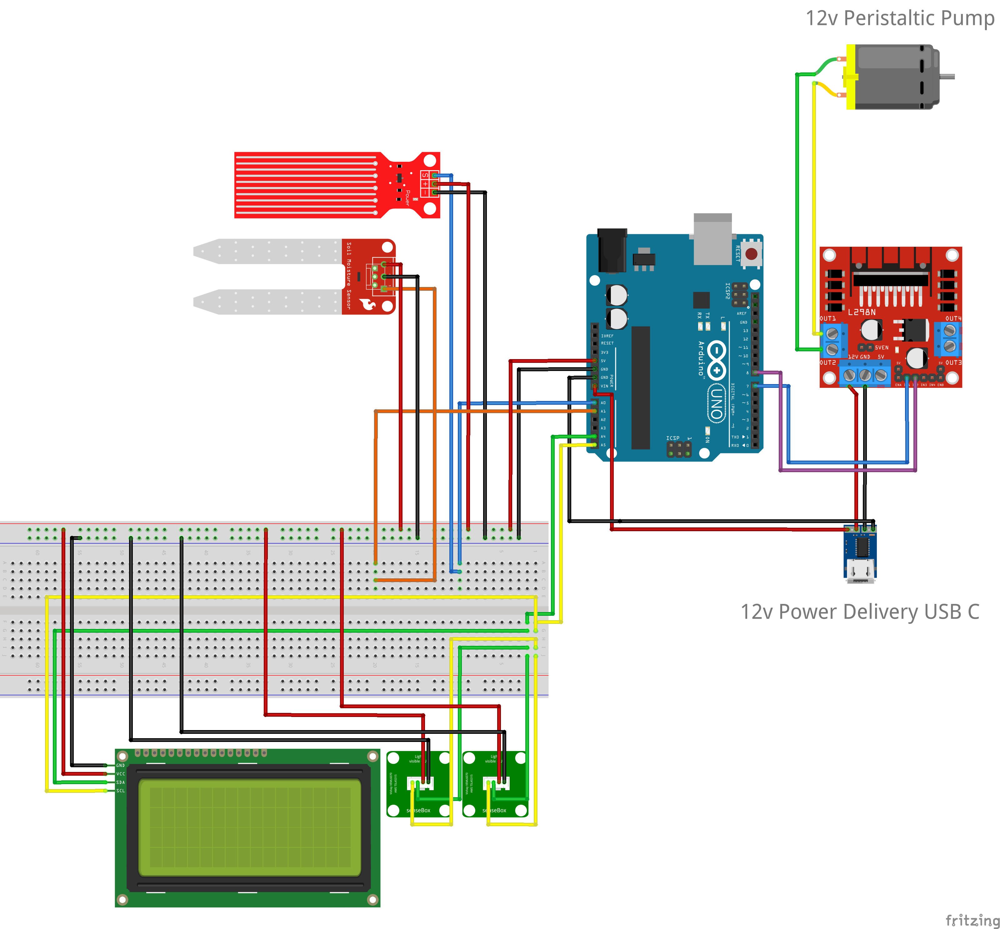

### Mechanics

### Fabrication Overview

| Fabrication method    | Files                                                 | Description                                                                       |
| ---------------------| ----------------------------------------------------- | --------------------------------------------------------------------------------- |
| **3‑D printing**     | `3d_printing/*.stl`                                   | Mounts for front panel, power bank, motor driver, and a modular solar-panel frame |
| **Laser-cutting**    | `lasercut/frontPanel.svg`, `lasercut/buttonPlate.svg` | 5 mm acrylic panels; hole spacing matches the 3‑D-printed rails                   |
| **Frame construction** | `frame/threadDripperAssambly.pdf`                  | MakerBeam XL aluminium frame; metal rails for the drip-head carriage and modular holder plates |

#### 3‑D Printed Parts

<p float="left">
  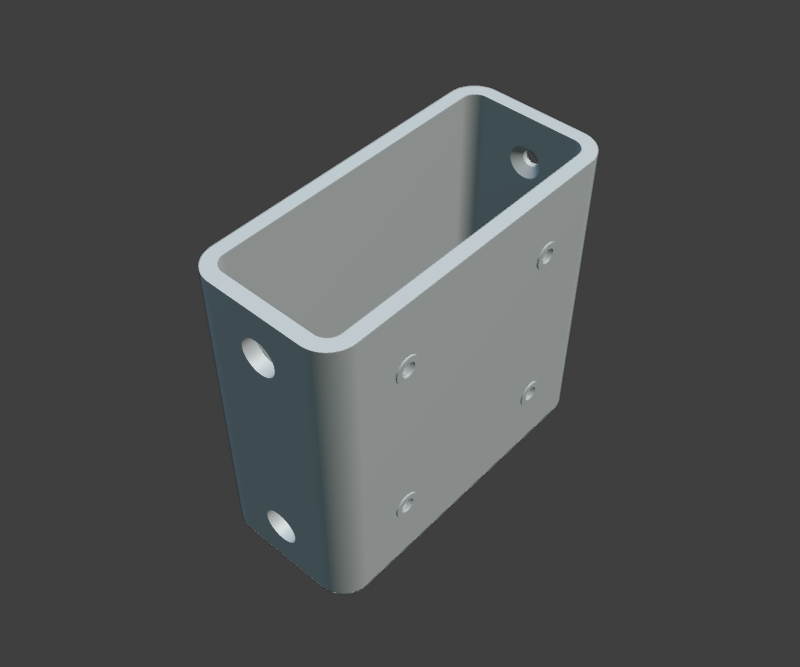
  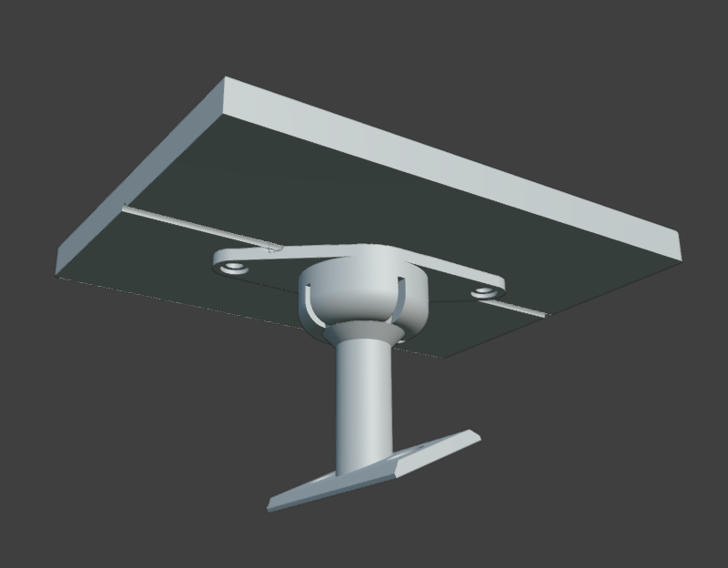
</p>

#### Laser-cut Parts

<p float="left">
  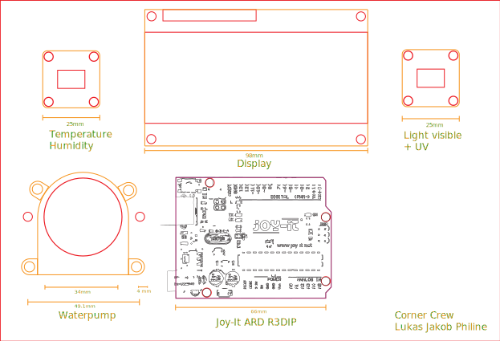
  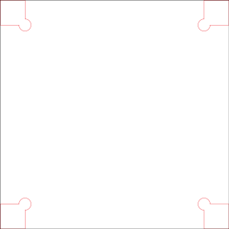
</p>

### Frame Construction

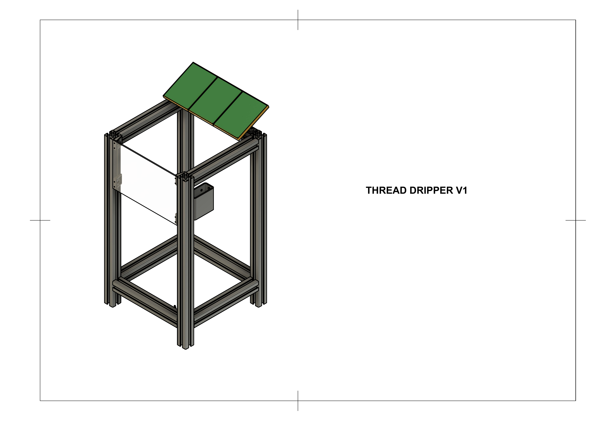  
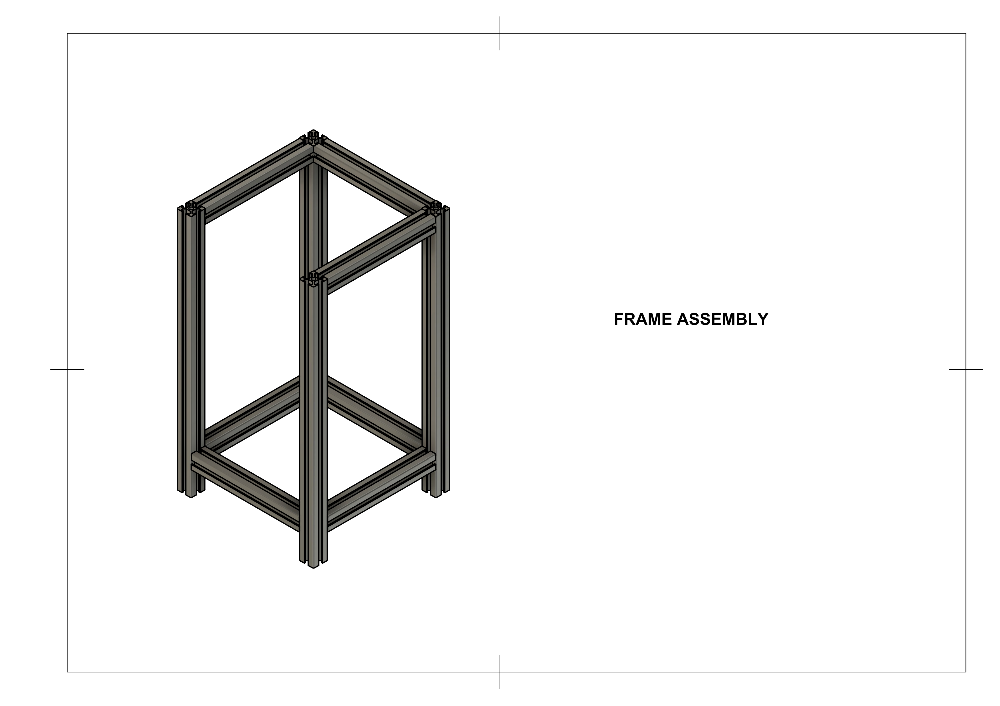  
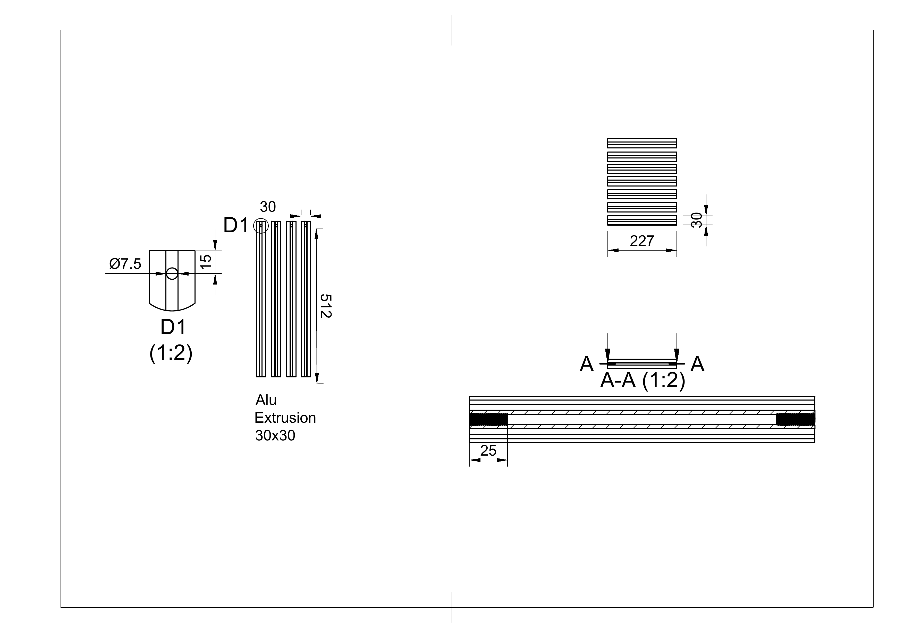  
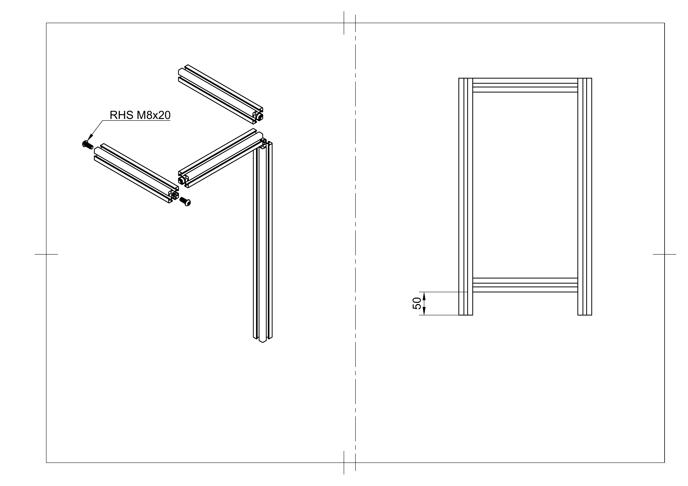  
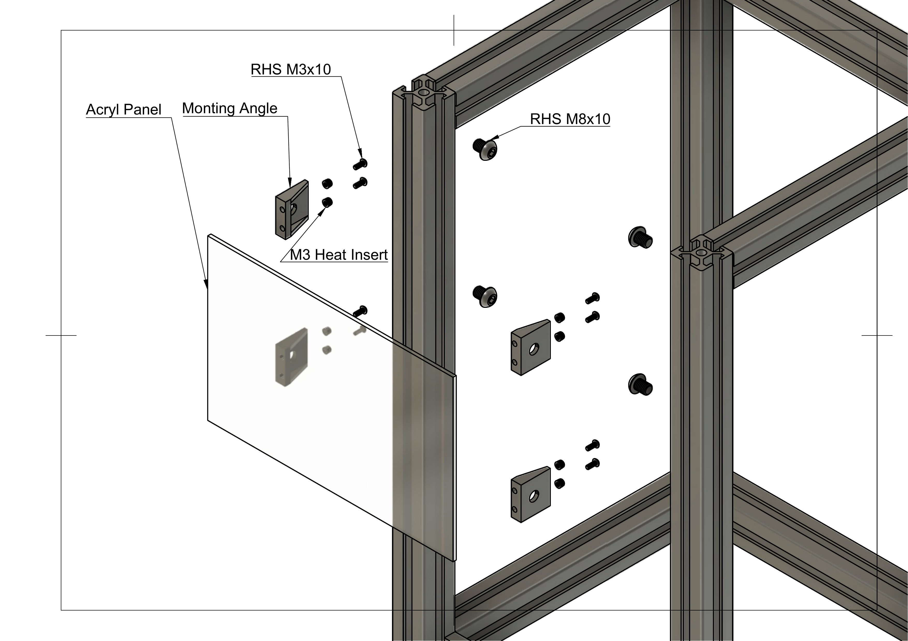  
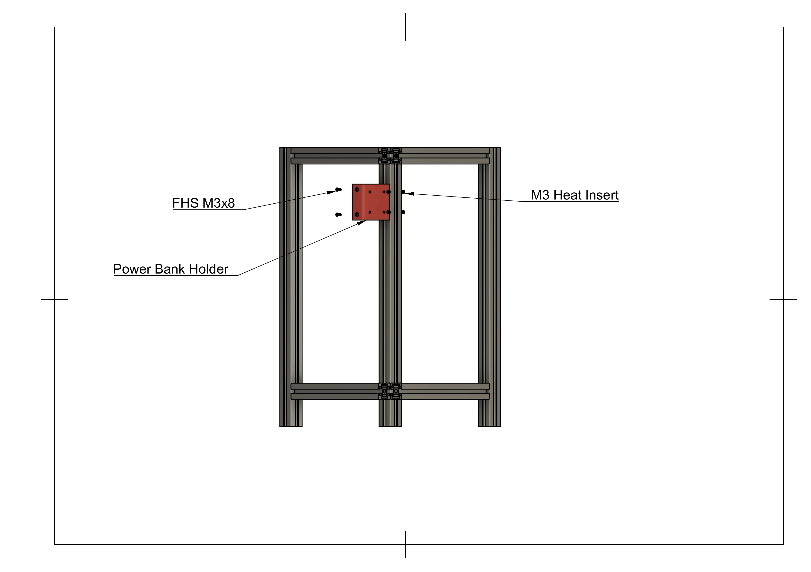  
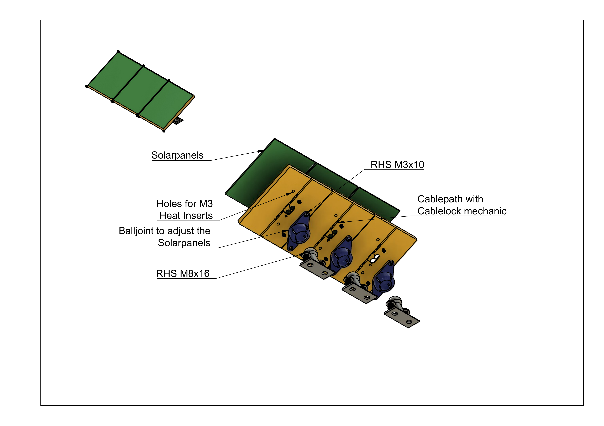

## Code / Software

### Arduino Sketch

* **File:** `arduino/ThreadDripperV1.ino`

* **Summary:** Reads environmental data (UV index, illuminance, temperature, relative humidity, soil moisture, water level) and drives a small pump/DC motor via an **L298N** driver whenever programmable thresholds are crossed.

* **Required libraries**

| Library              | Tested Version (IDE 2.3.2) |
| --------------------| --------------------------- |
| LiquidCrystal_I2C   | 1.1.2                       |
| Adafruit_VEML6070   | 1.0.5                       |
| Makerblog_TSL45315  | 1.0.0                       |
| Adafruit_HDC1000    | 1.2.2                       |
| L298N                | 1.0.0                       |


* **Code**

```cpp
#include <Wire.h>
#include <LiquidCrystal_I2C.h>
#include <Adafruit_VEML6070.h>
#include <Makerblog_TSL45315.h>
#include <Adafruit_HDC1000.h>
#include <L298N.h> 

// === LCD Setup ===
LiquidCrystal_I2C lcd(0x26, 20, 4);  // I2C address 0x26, 20 columns, 4 rows

// === Sensor Objects ===
Adafruit_VEML6070 uvSensor;
Makerblog_TSL45315 lightSensor(TSL45315_TIME_M4); // 400ms integration time
Adafruit_HDC1000 hdcSensor = Adafruit_HDC1000();  // Temperature and humidity sensor

// === Sensor Values ===
int waterLevel = 0;
int soilMoisture = 0;
uint16_t uvIndex = 0;
uint32_t lightLux = 0;
float temperature = 0.0;
float humidity = 0.0;

// === Motor Pins ===
const unsigned int MOTOR_IN1 = 7;
const unsigned int MOTOR_IN2 = 8;
L298N motor(MOTOR_IN1, MOTOR_IN2);  // Motor object using L298N

// === Condition Thresholds (Configuration Section) ===
const float TEMP_THRESHOLD = 15.0;         // Minimum temperature
const float HUMIDITY_MAX = 50.0;           // Maximum humidity
const uint16_t UV_THRESHOLD = 0;         // Minimum UV index
const uint32_t LIGHT_THRESHOLD = 100;      // Minimum light level
const int SOIL_MOISTURE_MAX = 100;         // Maximum soil moisture
const int WATER_LEVEL_MIN = 500;           // Minimum water tank level

// === Motor Runtime Configuration ===
const unsigned long MOTOR_RUN_TIME_MS = 500; // Motor runs for 0.5 seconds

// === Internal motor state tracking ===
bool motorIsRunning = false;
unsigned long motorStartTime = 0;

// === Check all environmental conditions ===
bool all_conditions_met(float temp, float hum, uint16_t uv, uint32_t lux, int soil, int water) {
  return (temp > TEMP_THRESHOLD &&
          hum < HUMIDITY_MAX &&
          uv > UV_THRESHOLD &&
          lux > LIGHT_THRESHOLD &&
          soil < SOIL_MOISTURE_MAX &&
          water > WATER_LEVEL_MIN);
}

// === Control motor based on condition ===
void control_motor(bool shouldRun) {
  if (shouldRun) {
    motor.forward();                         // (Re)start motor
    motorStartTime = millis();               // Reset timer
    motorIsRunning = true;
  }

  // Stop motor after the configured duration
  if (motorIsRunning && (millis() - motorStartTime >= MOTOR_RUN_TIME_MS)) {
    motor.stop();
    motorIsRunning = false;
  }
}

// === Arduino Setup ===
void setup() {
  Serial.begin(9600);
  Wire.begin();

  lcd.init();
  lcd.backlight();

  uvSensor.begin(VEML6070_1_T);
  lightSensor.begin();
  hdcSensor.begin(); // Just init, no fail handling here

  Serial.println("All sensors initialized.");
}

// === Main Loop ===
void loop() {
  // === Read all sensor values ===
  waterLevel = analogRead(A0);
  soilMoisture = analogRead(A1);
  uvIndex = uvSensor.readUV();
  lightLux = lightSensor.readLux();
  temperature = hdcSensor.readTemperature();
  humidity = hdcSensor.readHumidity();

  // === Serial Monitor Output ===
  Serial.print("Water Level: "); Serial.println(waterLevel);
  Serial.print("Soil Moisture: "); Serial.println(soilMoisture);
  Serial.print("UV Index: "); Serial.println(uvIndex);
  Serial.print("Light Lux: "); Serial.println(lightLux);
  Serial.print("Temperature: "); Serial.print(temperature); Serial.println(" C");
  Serial.print("Humidity: "); Serial.print(humidity); Serial.println(" %");

  // === Check Conditions ===
  bool conditionsOK = all_conditions_met(temperature, humidity, uvIndex, lightLux, soilMoisture, waterLevel);

  // === LCD Output ===
  lcd.clear();

  if (conditionsOK) {
    // Display only soil moisture and motor status
    lcd.setCursor(0, 1);
    lcd.print("Soil Moisture: ");
    lcd.print(soilMoisture);

    lcd.setCursor(3, 2); // Centered (approx) for 20 columns
    lcd.print(">> MOTOR ON <<");
  } else {
    // Full sensor data display
    lcd.setCursor(0, 0);
    lcd.print("Water: ");
    lcd.print(waterLevel);
    lcd.setCursor(10, 0);
    lcd.print("Soil: ");
    lcd.print(soilMoisture);

    lcd.setCursor(0, 1);
    lcd.print("UV: ");
    lcd.print(uvIndex);
    lcd.setCursor(10, 1);
    lcd.print("Lux: ");
    lcd.print(lightLux);

    lcd.setCursor(0, 2);
    lcd.print("Temp: ");
    lcd.print(round(temperature));
    lcd.print("C");
    lcd.setCursor(10, 2);
    lcd.print("Hum: ");
    lcd.print(humidity, 0);
    lcd.print("%");
  }

  // === Control Motor ===
  control_motor(conditionsOK);

  delay(1500); // Refresh every 1.5 seconds
}
```
<br>

#### Compile & Flash

1. Wire up the hardware (see [Hardware & Fabrication](#hardware--fabrication)).
2. Open `arduino/ThreadDripperV1.ino` in the Arduino IDE.
3. Select a board.
4. Optionally tweak thresholds and I²C addresses in the `#define`s.
5. Upload – done.

#### Troubleshooting

Scan for I2C Adresses.

```cpp

#include <Wire.h>

void setup() {
  Wire.begin();

  Serial.begin(9600);
  while (!Serial); // Leonardo: wait for Serial Monitor
  Serial.println("\nI2C Scanner");
}

void loop() {
  int nDevices = 0;

  Serial.println("Scanning...");

  for (byte address = 1; address < 127; ++address) {
    // The i2c_scanner uses the return value of
    // the Wire.endTransmission to see if
    // a device did acknowledge to the address.
    Wire.beginTransmission(address);
    byte error = Wire.endTransmission();

    if (error == 0) {
      Serial.print("I2C device found at address 0x");
      if (address < 16) {
        Serial.print("0");
      }
      Serial.print(address, HEX);
      Serial.println("  !");

      ++nDevices;
    } else if (error == 4) {
      Serial.print("Unknown error at address 0x");
      if (address < 16) {
        Serial.print("0");
      }
      Serial.println(address, HEX);
    }
  }
  if (nDevices == 0) {
    Serial.println("No I2C devices found\n");
  } else {
    Serial.println("done\n");
  }
  delay(5000); // Wait 5 seconds for next scan
}
``` 

During operation:

* The LCD cycles through sensor values every two seconds.
* Detailed logs are available on `Serial` @ 9600 baud.

> General note: Solar panel integration is planned for version V2.

## License

This project is released under the **MIT License**.  
See [`LICENSE`](LICENSE) for details.

---

## QR Code


